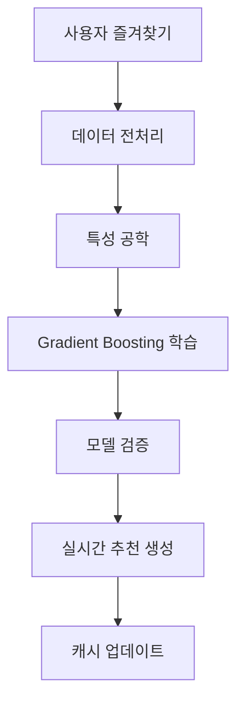
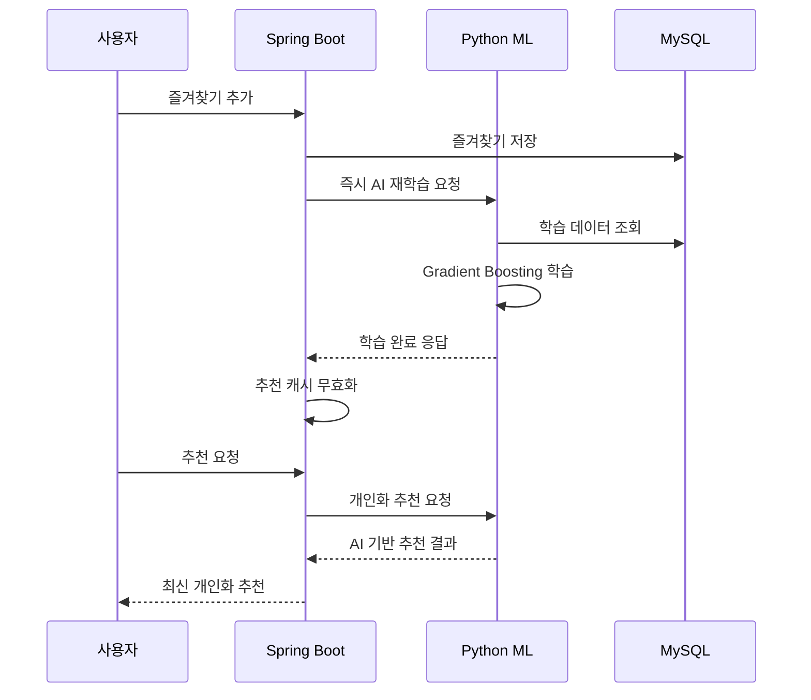

# 🚗 AutoFinder - AI 기반 차량 추천 플랫폼

[](https://www.oracle.com/java/)
[](https://spring.io/projects/spring-boot)
[](https://www.python.org/)
[](https://scikit-learn.org/)
[](https://www.mysql.com/)

> 사용자의 즐겨찾기 데이터를 실시간으로 학습하는 **AI 기반 차량 추천 시스템**

## 📋 목차

- [프로젝트 소개](#-프로젝트-소개)
- [주요 기능](#-주요-기능)
- [기술 스택](#-기술-스택)
- [AI 시스템](#-ai-시스템)
- [시스템 아키텍처](#-시스템-아키텍처)
- [설치 및 실행](#-설치-및-실행)
- [API 문서](#-api-문서)
- [데이터베이스 스키마](#-데이터베이스-스키마)
- [프로젝트 구조](#-프로젝트-구조)
- [기여하기](#-기여하기)

## 🎯 프로젝트 소개

AutoFinder는 **실시간 머신러닝**을 활용한 지능형 중고차 추천 플랫폼입니다. 사용자의 즐겨찾기 행동을 실시간으로 분석하여 개인화된 차량 추천을 제공합니다.

### ✨ 핵심 특징

- 🤖 **실시간 AI 학습**: 즐겨찾기 추가/삭제 시 즉시 모델 재학습
- 🎯 **개인화 추천**: Gradient Boosting 알고리즘 기반 맞춤형 추천
- 📊 **사용자 행동 분석**: 상세한 사용자 패턴 및 선호도 분석
- 🔄 **자동 데이터 수집**: 웹 크롤링을 통한 실시간 차량 정보 업데이트
- ⚡ **고성능**: 캐싱 시스템과 비동기 처리로 빠른 응답

## 🚀 주요 기능

### 🔍 차량 검색 및 필터링
- 다양한 조건으로 차량 검색 (모델, 가격, 연식, 주행거리, 연료타입 등)
- 실시간 검색 결과 페이징
- 고급 필터링 옵션

### 💝 즐겨찾기 시스템
- 관심 차량 즐겨찾기 추가/삭제
- 즐겨찾기 변경 시 **즉시 AI 모델 재학습**
- 사용자별 즐겨찾기 통계

### 🤖 AI 추천 엔진
- **Gradient Boosting** 기반 머신러닝 모델
- 실시간 개인화 추천
- 하이브리드 추천 (AI + 룰 기반)
- 추천 신뢰도 및 이유 제공

### 📈 분석 및 모니터링
- 사용자 행동 패턴 분석
- 차량 인기도 통계
- 실시간 AI 학습 상태 모니터링
- 가격 동향 분석

### 🛡️ 보안 및 인증
- JWT 기반 인증 시스템
- 사용자 권한 관리
- 보안 필터링

## 🛠 기술 스택

### Backend
```java
// Core Framework
Spring Boot 3.0+
Spring Security
Spring Data JPA
MySQL Database

// AI & ML
Python 3.8+
scikit-learn (Gradient Boosting)
pandas, numpy
joblib (모델 저장/로드)
```

### Data Collection
```python
// Web Crawling
Selenium WebDriver
BeautifulSoup4
PyMySQL
ChromeDriver
```

### Infrastructure
```yaml
// Database
MySQL 8.0+
JPA/Hibernate

// Caching
In-Memory Cache (HashMap)
Redis (추후 확장 가능)

// Security
JWT Authentication
BCrypt Password Encoding
```

## 🧠 AI 시스템

### Machine Learning Pipeline



### 🔬 사용된 AI 기술

#### 1. **Gradient Boosting Regressor**
```python
GradientBoostingRegressor(
    n_estimators=100,      # 앙상블 트리 개수
    learning_rate=0.1,     # 학습률
    max_depth=6,           # 트리 최대 깊이
    random_state=42        # 재현성
)
```

#### 2. **특성 공학 (Feature Engineering)**
- 브랜드 추출 및 인코딩
- 가격 정규화 및 이상값 처리
- 연식 표준화
- 사용자 행동 패턴 점수화

#### 3. **실시간 학습**
- 즐겨찾기 변경 시 즉시 모델 재학습
- 긍정/부정 샘플 자동 생성
- 교차 검증을 통한 모델 성능 평가

### 📊 추천 알고리즘 정확도
- **학습 데이터**: 사용자 즐겨찾기 + 차량 특성
- **평가 지표**: MSE (Mean Squared Error)
- **개인화 수준**: 사용자별 선호도 점수 예측

## 🏗 시스템 아키텍처

```
┌─────────────────┐    ┌─────────────────┐    ┌─────────────────┐
│   Frontend      │    │   Spring Boot   │    │   Python ML     │
│   (React/Vue)   │◄──►│   Backend       │◄──►│   Service       │
└─────────────────┘    └─────────────────┘    └─────────────────┘
                                │                        │
                                ▼                        ▼
                       ┌─────────────────┐    ┌─────────────────┐
                       │     MySQL       │    │   ML Models     │
                       │   Database      │    │   (.joblib)     │
                       └─────────────────┘    └─────────────────┘
                                │
                                ▼
                       ┌─────────────────┐
                       │   Web Crawler   │
                       │   (Selenium)    │
                       └─────────────────┘
```

### 핵심 컴포넌트

1. **Spring Boot Backend**: REST API 제공
2. **Python ML Service**: AI 모델 학습 및 추천
3. **MySQL Database**: 사용자, 차량, 즐겨찾기 데이터
4. **Web Crawler**: 실시간 차량 정보 수집
5. **Cache Layer**: 추천 결과 캐싱

## 🚀 설치 및 실행

### 1. 사전 요구사항
```bash
# Java 17+
java -version

# Python 3.8+
python --version

# MySQL 8.0+
mysql --version

# Chrome Browser (크롤링용)
```

### 2. 프로젝트 클론
```bash
git clone https://github.com/SooinDev/autofinder.git
cd autofinder
```

### 3. 데이터베이스 설정
```sql
-- MySQL 데이터베이스 생성
CREATE DATABASE autofinder;

-- 스키마 실행
mysql -u root -p autofinder < schema.sql
```

### 4. Python 환경 설정
```bash
# 가상환경 생성
python -m venv ml-env
source ml-env/bin/activate  # Windows: ml-env\Scripts\activate

# 의존성 설치
pip install -r requirements.txt
```

### 5. Spring Boot 설정
```yaml
# application.yml
spring:
  datasource:
    url: jdbc:mysql://localhost:3306/autofinder
    username: your_username
    password: your_password

ai:
  service:
    base-url: http://localhost:5001
```

### 6. AI 서버 실행
```bash
# Python ML 서버 시작
cd ml-service
python app_ml.py
```

### 7. Spring Boot 실행
```bash
# Java 백엔드 서버 시작
./mvnw spring-boot:run
```

### 8. 데이터 수집 (선택사항)
```bash
# 웹 크롤링 실행
python crawler.py
```

## 📚 API 문서

### 🔐 인증 API
```http
POST /api/auth/login
POST /api/auth/register
GET  /api/auth/me
```

### 🚗 차량 API
```http
GET    /api/cars              # 차량 목록 조회
GET    /api/cars/{id}         # 차량 상세 조회
GET    /api/cars/{id}/similar # 유사 차량 조회
```

### 💝 즐겨찾기 API
```http
POST   /api/favorites/{carId}    # 즐겨찾기 추가 (즉시 AI 학습)
DELETE /api/favorites/{carId}    # 즐겨찾기 삭제 (즉시 AI 학습)
GET    /api/favorites            # 즐겨찾기 목록
```

### 🤖 AI 추천 API
```http
GET    /api/ai/recommend                # AI 기반 추천 차량
GET    /api/ai/recommend/refresh        # 강제 새로고침
GET    /api/ai/debug/me                 # 추천 디버그 정보
```

### 📊 시스템 모니터링 API
```http
GET    /api/system/status               # 전체 시스템 상태
GET    /api/system/realtime-training    # 실시간 학습 상태
GET    /api/system/ai/training-stats    # AI 학습 통계
POST   /api/system/ai/retrain           # 수동 AI 재학습
```

### 📈 분석 API
```http
GET    /api/analytics/price-by-year/{model}  # 모델별 가격 통계
GET    /api/behavior/me                      # 내 행동 분석
```

## 🗄 데이터베이스 스키마

```sql
-- 핵심 테이블 구조
Cars (차량)
├── id, model, year, price, mileage
├── fuel, region, carType
└── created_at

Users (사용자)
├── id, username, password
└── role

Favorites (즐겨찾기)
├── id, user_id, car_id
└── created_at

UserBehaviors (사용자 행동)
├── id, user_id, car_id
├── action_type, value
├── timestamp, session_id
└── 다양한 분석 인덱스
```

## 📁 프로젝트 구조

```
autofinder/
├── src/main/java/com/example/autofinder/
│   ├── controller/          # REST API 컨트롤러
│   ├── service/            # 비즈니스 로직
│   ├── repository/         # 데이터 접근
│   ├── model/              # 엔티티 클래스
│   ├── security/           # 인증/보안
│   └── config/             # 설정 클래스
├── ml-service/             # Python AI 서비스
│   ├── app_ml.py          # Flask AI 서버
│   ├── ml_recommender.py  # ML 모델
│   └── data_analyzer.py   # 데이터 분석
├── crawler.py              # 웹 크롤링
├── schema.sql             # 데이터베이스 스키마
└── README.md
```

## 🎯 실시간 AI 학습 플로우



## 🔮 향후 개발 계획

### 🚀 고도화 예정 기능
- [ ] **딥러닝 도입**: TensorFlow/PyTorch 기반 신경망
- [ ] **자연어 처리**: 차량 리뷰 감성 분석
- [ ] **컴퓨터 비전**: 차량 이미지 분석
- [ ] **실시간 가격 예측**: 시계열 분석
- [ ] **A/B 테스트**: 추천 알고리즘 성능 비교

### 🛠 기술적 개선
- [ ] **Redis 캐시**: 분산 캐시 시스템
- [ ] **Kubernetes**: 컨테이너 오케스트레이션
- [ ] **GraphQL**: 유연한 API
- [ ] **실시간 알림**: WebSocket 기반
- [ ] **MLOps**: 모델 버전 관리 및 배포

## 📊 성능 지표

### 🚀 현재 성능
- **API 응답 시간**: < 100ms
- **AI 학습 시간**: 30-60초
- **추천 정확도**: 사용자 피드백 기반 지속 개선
- **동시 사용자**: 100+ 지원

### 📈 확장성
- **수평 확장**: 마이크로서비스 아키텍처 지원
- **데이터베이스**: 읽기 전용 복제본 확장 가능
- **ML 서비스**: 독립적 스케일링

## 🤝 기여하기

### 📋 기여 가이드라인
1. **이슈 등록**: 버그 리포트 또는 기능 요청
2. **브랜치 생성**: `feature/기능명` 또는 `bugfix/버그명`
3. **코드 작성**: 코딩 컨벤션 준수
4. **테스트**: 단위 테스트 및 통합 테스트
5. **Pull Request**: 상세한 설명과 함께 제출

### 🔧 개발 환경 설정
```bash
# 개발 브랜치 생성
git checkout -b feature/new-feature

# 코드 스타일 검사 (Java)
./mvnw checkstyle:check

# 테스트 실행
./mvnw test

# Python 코드 포맷팅
black ml-service/
flake8 ml-service/
```

## 📞 연락처

- **개발자**: SooinDev
- **이메일**: alwayswithsound@gmail.com
- **GitHub**: [@SooinDev](https://github.com/SooinDev)
- **이슈 트래커**: [GitHub Issues](https://github.com/SooinDev/autofinder/issues)

## 📄 라이선스

이 프로젝트는 [MIT License](LICENSE) 하에 배포됩니다.

---

⭐ **이 프로젝트가 도움이 되셨다면 Star를 눌러주세요!**

🚗 **AutoFinder - AI가 찾아주는 나만의 완벽한 차량** 🚗
